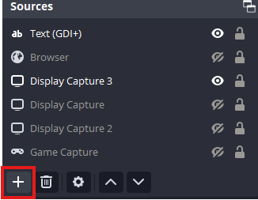
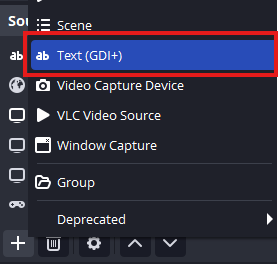
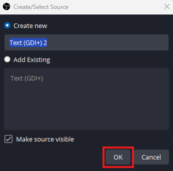
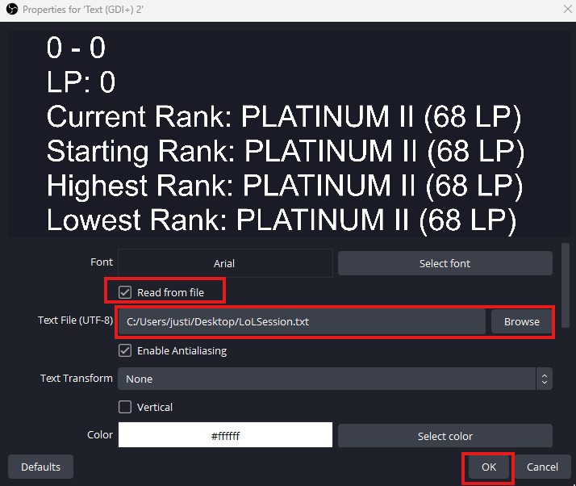
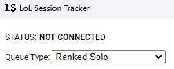

# LOL-SESSION

This is a simple app to help twitch streamers track their league play session automatically. It outputs a text file that will update as games are completed.

## Guide

### Running The Program

Download the .exe then run it. It should auto-detect if you log into your league client, but it is more reliable if you open the program after the league client is already open. I've attached a screenshot for OBS, but it should be similar on any stream manager. You can set a custom output file, but the default will be YourDesktop/LoLSession.txt. Settings should auto-save. 

### Adding Source (OBS)

 
 

## Demo

## FAQ

### Will this get me banned?

No. This project does not read memory or work with your user data. The only functions it performs are writing to two text files (the output file and a settings file), and reading from the LCU (League Client Updater). You can read more about the LCU here: https://riot-api-libraries.readthedocs.io/en/latest/lcu.html; 

### Will this steal my account info?

No. 
  1. The code does not access any resources except the LCU, which is hosted locally (127.0.0.1). I don't read user credentials or user data. If you are unsure, you can look through the code yourself. 
  2. I have better things to do with my time.

### I installed and ran the app, but it is not working.

Check the top option - If it says "NOT CONNECTED" then it's not picking up your league client. Try relaunching your client and the app. You can also leave the general setting 'Close client during game' as 'Always' and that might help stability. 

### I am getting a warning installing this application. Is it safe?

Yes. Since I coded this quickly and wanted to get it out, I did not opt for applying and purchasing a code-signing certificate. If this project gets enough interest I can set that up. You can read more about it here: https://www.electronjs.org/docs/latest/tutorial/code-signing

### Does this work for the other game modes in the dropdown?

Probably? I didn't have time to test them, but they should work the same way. 